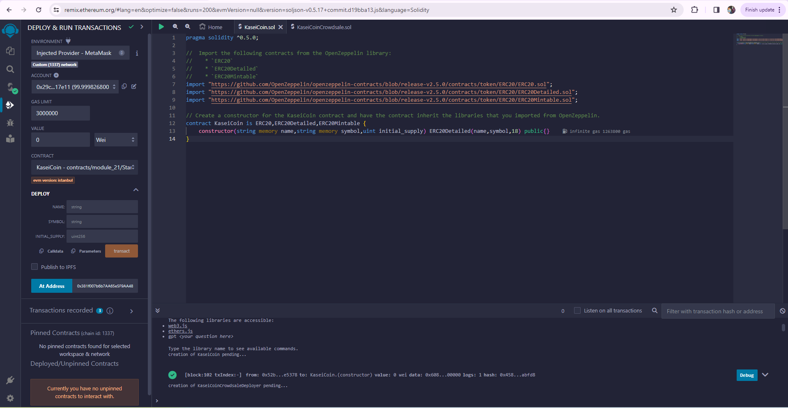
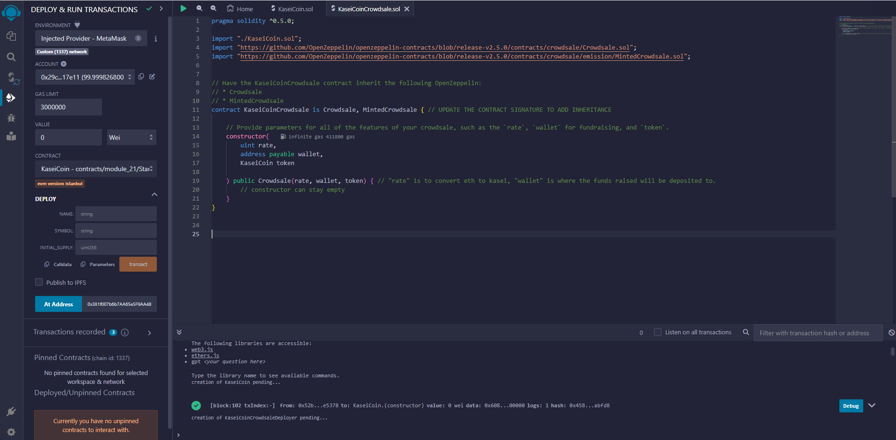
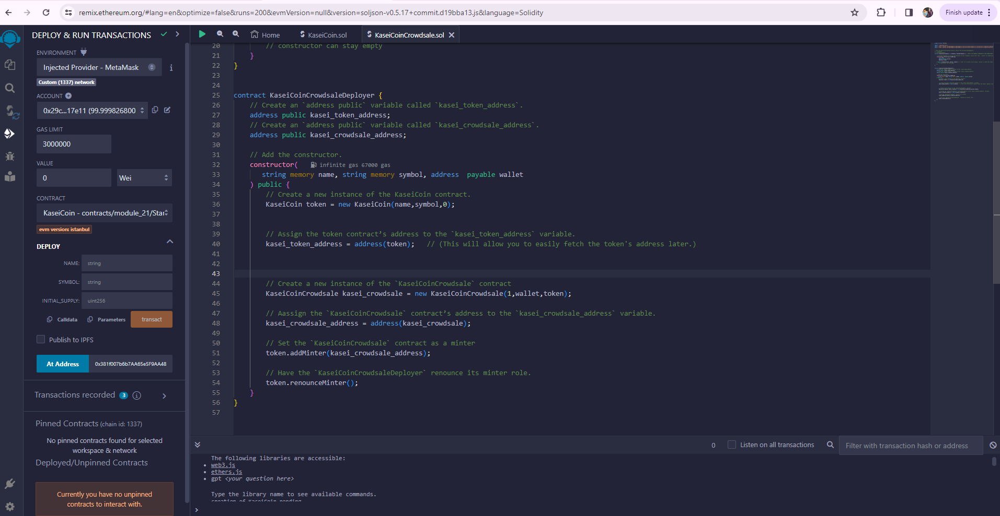
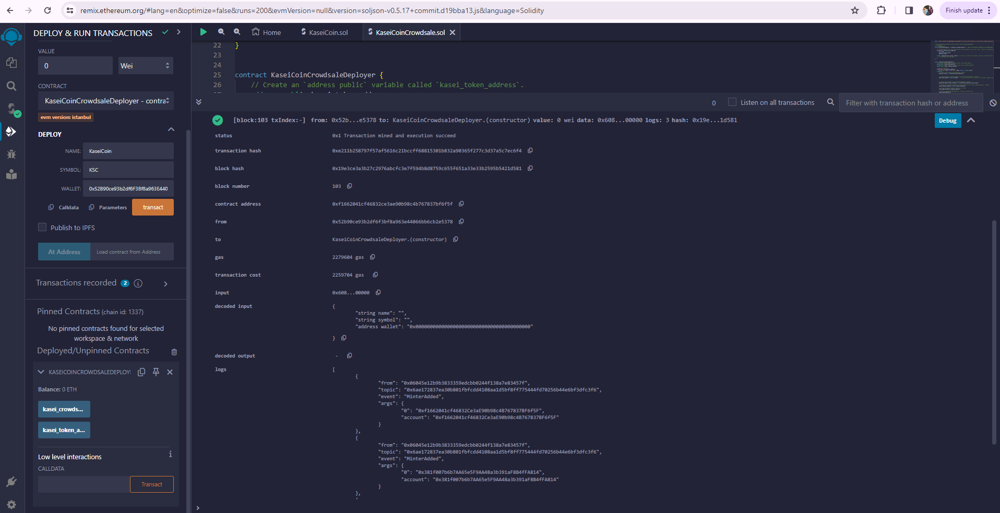
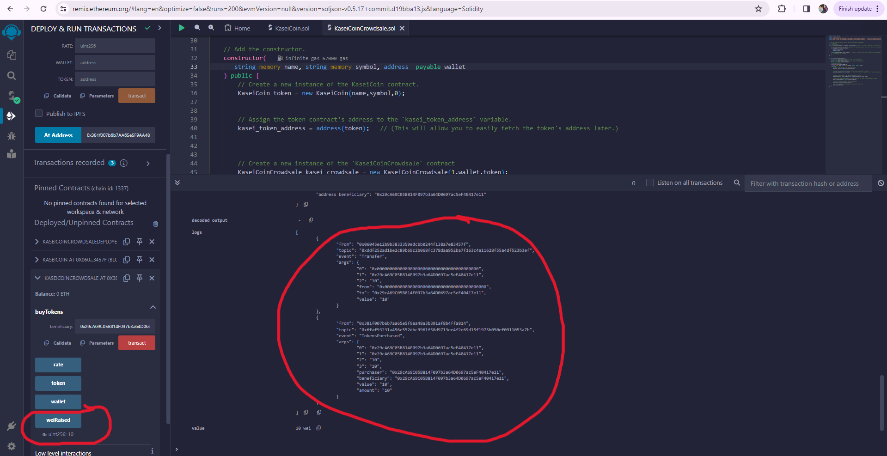
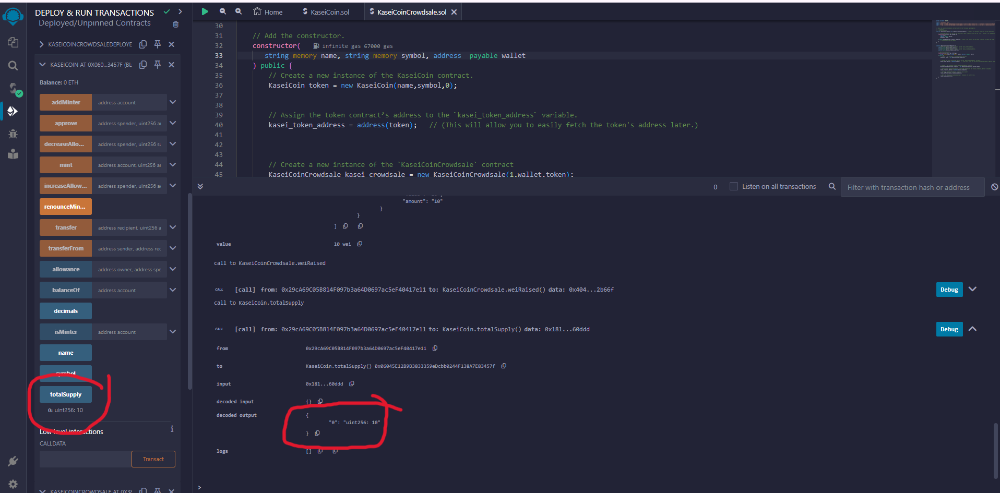

# Unit 21: Martian Token Crowdsale

## Background

After waiting for years and passing several tests, the Martian Aerospace Agency selected you to become part of the first human colony on Mars. As a prominent fintech professional, they chose you to lead a project developing a monetary system for the new Mars colony. You decided to base this new system on blockchain technology and to define a new cryptocurrency named **KaseiCoin**. (Kasei means Mars in Japanese.)

KaseiCoin will be a fungible token that’s ERC-20 compliant. You’ll launch a crowdsale that will allow people who are moving to Mars to convert their earthling money to KaseiCoin.

## Instructions

The steps for this assignment are divided into the following subsections:

1. Create the KaseiCoin Token Contract

2. Create the KaseiCoin Crowdsale Contract

3. Create the KaseiCoin Deployer Contract

4. Deploy and Test the Crowdsale on a Local Blockchain

### Step 1: Create the KaseiCoin Token Contract

1. Import the following contracts from the OpenZeppelin library:

    * `ERC20`

    * `ERC20Detailed`

    * `ERC20Mintable`

2. Define a contract for the KaseiCoin token, and name it `KaseiCoin`. Have the contract inherit the three contracts that you just imported from OpenZeppelin.

3. Inside your `KaseiCoin` contract, add a constructor with the following parameters: `name`, `symbol`, and `initial_supply`.

4. As part of your constructor definition, add a call to the constructor of the `ERC20Detailed` contract, passing the parameters `name`, `symbol`, and `18`. (Recall that 18 is the value for the `decimals` parameter.)

### Step 2: Create the KaseiCoin Crowdsale Contract

1. Have this contract inherit the following OpenZeppelin contracts:

    * `Crowdsale`

    * `MintedCrowdsale`

2. In the `KaisenCoinCrowdsale` constructor, provide parameters for all the features of your crowdsale, such as `rate`, `wallet` (where to deposit the funds that the token raises), and `token`. Configure these parameters as you want for your KaseiCoin token.

3. Compile the contract by using compiler version 0.5.0.

### Step 3: Create the KaseiCoin Deployer Contract

In the `KaseiCoinCrowdsaleDeployer` contract, you’ll add variables to store the addresses of the `KaseiCoin` and `KaseiCoinCrowdsale` contracts, which this contract will deploy. Finally, you’ll complete the `KaseiCoinCrowdsaleDeployer` contract. To do so, complete the following steps:

1. Create an `address public` variable named `kasei_token_address`, which will store the `KaseiCoin` address once that contract has been deployed.

2. Create an `address public` variable named `kasei_crowdsale_address`, which will store the `KaseiCoinCrowdsale` address once that contract has been deployed.

3. Add the following parameters to the constructor for the `KaseiCoinCrowdsaleDeployer` contract: `name`, `symbol`, and `wallet`.

4. Inside of the constructor body (that is, between the braces), complete the following steps:

    * Create a new instance of the `KaseiCoinToken` contract.

    * Assign the address of the KaseiCoin token contract to the `kasei_token_address` variable. (This will allow you to easily fetch the token's address later.)

    * Create a new instance of the `KaseiCoinCrowdsale` contract by using the following parameters:

      * The `rate` parameter: Set `rate` equal to 1 to maintain parity with ether.

      * The `wallet` parameter: Pass in `wallet` from the main constructor. This is the wallet that will get paid all the ether that the crowdsale contract raises.

      * The `token` parameter: Make this the `token` variable where `KaseiCoin` is stored.

    * Assign the address of the KaseiCoin crowdsale contract to the `kasei_crowdsale_address` variable. (This will allow you to easily fetch the crowdsale’s address later.)

    * Set the `KaseiCoinCrowdsale` contract as a minter.

    * Have the `KaseiCoinCrowdsaleDeployer` renounce its minter role.

5. Compile the contract by using compiler version 0.5.0.

### Step 4: Deploy and Test the Crowdsale on a Local Blockchain

In this subsection, you’ll deploy the crowdsale to a local blockchain. You’ll then perform a real-world, preproduction test of your crowdsale. To do so, complete the following steps:

1. Deploy the crowdsale to a local blockchain by using Remix, MetaMask, and Ganache.

2. Test the functionality of the crowdsale by using test accounts to buy new tokens and checking the amount of wei that the crowdsale contract has raised.

3. Review the total supply of minted tokens 

